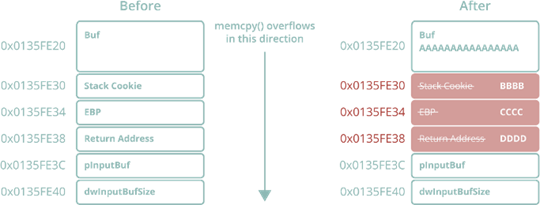
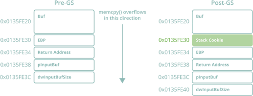

# Windows Exploit Development

The topic of memory corruption exploits can be a difficult one to initially break in to. When I first began to explore this topic on the Windows OS I was immediately struck by the surprising shortage of modern and publicly available information dedicated to it. The purpose of this post is not to reinvent the wheel, but rather to document my own learning process as I explored this topic and answer the questions which I myself had as I progressed. I also aim to consolidate and modernize information surrounding the evolution of exploit mitigation systems which exists many places online in outdated and/or incomplete form. This evolution makes existing exploitation techniques more complex, and in some cases renders them obsolete entirely. As I explored this topic I decided to help contribute to a solution to this problem of outdated beginner-oriented exploit information by documenting some of my own experiments and research using modern compilers on a modern OS. This particular text will focus on Windows 10 and Visual Studio 2019, using a series of C/C++ tools and vulnerable applications I’ve written (on my Github [here](https://github.com/forrest-orr/ExploitDev)). I’ve decided to begin this series with some of the first research I did, which focuses on 32-bit stack overflows running under Wow64.

Classic Stack Overflows

The classic stack overflow is the easiest memory corruption exploit to understand. A vulnerable application contains a function that writes user-controlled data to the stack without validating its length. This allows an attacker to:

1\.       Write a shellcode to the stack.

2\.       Overwrite the return address of the current function to point to the shellcode.

If the stack can be corrupted in this way without breaking the application, the shellcode will execute when the exploited function returns. An example of this concept is as follows:

```
#include
#include
#include
uint8_t OverflowData[] =
"AAAAAAAAAAAAAAAA" // 16 bytes for size of buffer
"BBBB" // +4 bytes for stack cookie
"CCCC" // +4 bytes for EBP
"DDDD"; // +4 bytes for return address
void Overflow(uint8_t* pInputBuf, uint32_t dwInputBufSize) {
char Buf[16] = { 0 };
memcpy(Buf, pInputBuf, dwInputBufSize);
}

int32_t wmain(int32_t nArgc, const wchar_t* pArgv[]) {
printf("... passing %d bytes of data to vulnerable function\r\n", sizeof(OverflowData) - 1);
Overflow(OverflowData, sizeof(OverflowData) - 1);
return 0;
}
```


<figure><figcaption><p>Classic overflow overwriting return address with 0x44444444</p></figcaption></figure>

The stack overflow is a technique which (unlike string format bugs and heap overflows) _can still be exploited in a modern Windows application_ using the same concept it did in its inception decades ago with the publication of [Smashing the Stack for Fun and Profit](https://www.eecs.umich.edu/courses/eecs588/static/stack\_smashing.pdf). However, the mitigations that now apply to such an attack are considerable.

By default on Windows 10, an application compiled with Visual Studio 2019 will inherit a default set of security mitigations for stack overflow exploits which include:

1\.       [SafeCRT](https://docs.microsoft.com/en-us/cpp/error-messages/compiler-warnings/compiler-warning-level-3-c4996?view=vs-2019)

&#x20;

2\.       [Stack cookies](https://docs.microsoft.com/en-us/cpp/build/reference/gs-buffer-security-check?view=vs-2019) and safe variable ordering

&#x20;

3\.       [Secure Structured Exception Handling](https://docs.microsoft.com/en-us/cpp/build/reference/safeseh-image-has-safe-exception-handlers?view=vs-2019) (SafeSEH)

&#x20;

4\.       [Data Execution Prevention](https://docs.microsoft.com/en-us/windows/win32/memory/data-execution-prevention) (DEP)

&#x20;

5\.       [Address Space Layout Randomization](https://docs.microsoft.com/en-us/cpp/build/reference/dynamicbase-use-address-space-layout-randomization?view=vs-2019) (ASLR)

&#x20;

6\.       [Structured Exception Handling Overwrite Protection](https://msrc-blog.microsoft.com/2009/02/02/preventing-the-exploitation-of-structured-exception-handler-seh-overwrites-with-sehop/) (SEHOP)

&#x20;

<figure><figcaption></figcaption></figure>

The depreciation of vulnerable CRT APIs such as [strcpy](http://www.cplusplus.com/reference/cstring/strcpy/) and the introduction of secured versions of these APIs (such as [strcpy\_s](https://docs.microsoft.com/en-us/cpp/c-runtime-library/reference/strcpy-s-wcscpy-s-mbscpy-s?view=vs-2019)) via the SafeCRT libraries has not been a comprehensive solution to the problem of stack overflows. APIs such as [memcpy](https://docs.microsoft.com/en-us/cpp/c-runtime-library/reference/memcpy-wmemcpy?view=vs-2019) remain valid, as do non-POSIX variations of these CRT APIs (for example [KERNEL32.DLL!lstrcpyA](https://docs.microsoft.com/en-us/windows/win32/api/winbase/nf-winbase-lstrcpya)). Attempting to compile an application in Visual Studio 2019 which contains one of these depreciated APIs results in a [fatal compilation error](https://docs.microsoft.com/en-us/cpp/c-runtime-library/security-features-in-the-crt?view=vs-2019), albeit suppressable.

&#x20;

Stack cookies are the security mechanism that attempts to truly “fix” and prevent stack overflows from being exploited at runtime in the first place. _SafeSEH_ and _SEHOP_ mitigate a workaround for stack cookies, while _DEP_ and _ASLR_ are not stack-specific mitigations in the sense that they do not prevent a stack overflow attack or EIP hijack from occurring. Instead, they make the task of executing shellcode through such an attack much more complex. All of these mitigations will be explored in depth as this text advances.This next section will focus on stack cookies — our primary adversary when attempting a modern stack overflow.

Stack Cookies, GS and GS++

With the release of Visual Studio 2003, Microsoft included a new stack overflow mitigation feature called [GS](https://docs.microsoft.com/en-us/cpp/build/reference/gs-buffer-security-check?view=vs-2019) into its MSVC compiler. Two years later, they enabled it by default with the release of Visual Studio 2005.

<figure><figcaption></figcaption></figure>

There is a good deal of outdated and/or incomplete information on the topic of GS online, including the original [Corelan tutorial](https://www.corelan.be/index.php/2009/09/21/exploit-writing-tutorial-part-6-bypassing-stack-cookies-safeseh-hw-dep-and-aslr/) which discussed it back in 2009. The reason for this is that the GS security mitigation has evolved since its original release, and in Visual Studio 2010 an enhanced version of GS called _GS++_ replaced the original GS feature (discussed in an excellent [Microsoft Channel9 video](https://channel9.msdn.com/Shows/Going%2BDeep/Louis-Lafreniere-Next-Generation-Buffer-Overrun-Protection-gs?term=gs%2B%2B\&lang-en=true) created at the time). Confusingly, Microsoft never updated the name of its compiler switch and it remains “/GS” to this day despite in reality being GS++.

_GS_ is fundamentally a security mitigation compiled into a program on the binary level which places strategic stack corruption checks (through use of a stack cookie) in functions containing what Microsoft refers to as “GS buffers” (buffers susceptible to stack overflow attacks). While the original GS only considered arrays of 8 or more elements with an element size of 1 or 2 (char and wide char) as GS buffers, GS++ substantially expanded this definition to include:

1\.       Any array (regardless of length or element size)

2\.       Structs (regardless of their contents)

\


<figure><figcaption></figcaption></figure>

&#x20;

Figure 2 – GS stack canary mechanism

This enhancement has great relevance to modern stack overflows, as it essentially renders all functions susceptible to stack overflow attacks immune to _EIP_ hijack via the return address. This in turn has consequences for other antiquated exploitation techniques such as ASLR bypass via partial [EIP overwrite](https://www.google.com/search?source=hp\&ei=SBSLX7niLt7KytMP5dSkgA0\&q=%22partial%2Beip%2Boverwrite%22\&oq=%22partial%2Beip%2Boverwrite%22\&gs\_lcp=CgZwc3ktYWIQAzIECAAQHjoGCAAQBxAeOgIILjoFCAAQsQM6AggAOggILhDHARCvAToICAAQsQMQyQM6CAgAEAcQChAeOgoIABAIEAcQChAeOgUIABDJAzoECAAQDVCPC1icVmCqV2gAcAB4AIABpAGIAdgNkgEEMjIuMZgBAKABAaoBB2d3cy13aXo\&sclient=psy-ab\&ved=0ahUKEwi5po3y\_rvsAhVepXIEHWUqCdAQ4dUDCAg\&uact=5) (also [discussed](https://www.corelan.be/index.php/2009/09/21/exploit-writing-tutorial-part-6-bypassing-stack-cookies-safeseh-hw-dep-and-aslr/) in some of the classic Corelan tutorials), which was popularized by the famous Vista [CVE-2007-0038](https://www.cvedetails.com/cve/CVE-2007-0038/) Animated Cursor exploit that took advantage of a struct overflow in 2007. With the advent of _GS++_ in 2010, partial _EIP_ overwrite stopped being viable as a method for ASLR bypass in the typical stack overflow scenario.

<figure><figcaption></figcaption></figure>

The [information on MSDN](https://docs.microsoft.com/en-us/cpp/build/reference/gs-buffer-security-check?view=vs-2019) (last updated four years ago in 2016) regarding _GS_ contradicts some of my own tests when it comes to GS coverage. For example, Microsoft lists the following variables as examples of non-GS buffers:

```
char *pBuf[20];
void *pv[20]; 
char buf[4];
int buf[2];
struct { int a; int b; };
```

