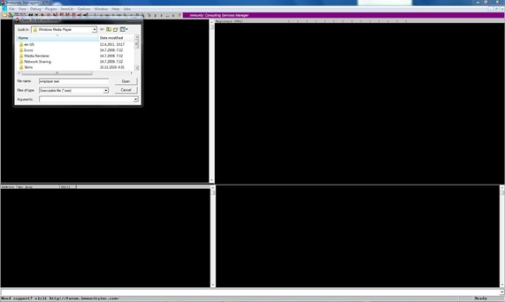
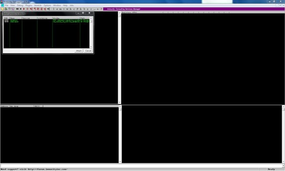

# Immunity Debugger

Immunity debugger is a binary code analysis tool developed by immunityinc. Its based on popular Olly debugger, but it enables use of python scripts to automatize repetitive jobs. You can download immunity debugger by visiting [immunityinc webpage](http://www.immunityinc.com/products-immdbg.shtml). In this first part of tutorial I will cover some useful windows that Immunity debugger offers which give us insight into program workings.

## **Loading the application**

There are two ways you can load application into immunity debugger. First way is to start the application directly from the debugger. To do this, click on the File tab and click Open. Then find your application directory, select file and click Open.

<figure><figcaption></figcaption></figure>

Second way is to first start application outside debugger and then when its running to attach it to the debugger. To do this click on the File tab and click Attach. You'll see list of running processes you can attach to the debugger. Select process you wish to debug and click Attach.

<figure><figcaption></figcaption></figure>

Both ways are equally good, but I tend to first open the application and then attach it inside of debugger.

## **CPU screen overview**

When application is loaded, immunity debugger opens default window, CPU view. As it can be seen on the picture, CPU screen is divided in four parts: Disassembly(1), Registers(2), Dump(3), Stack(4).
