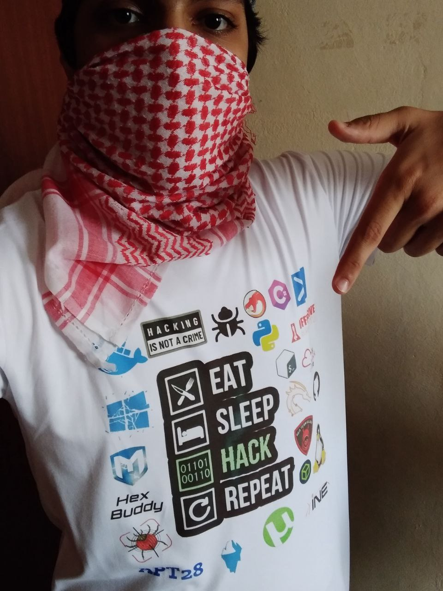

# 😎 Whoami ?

<figure><figcaption></figcaption></figure>

 

<figure><figcaption></figcaption></figure>

 

<figure><figcaption></figcaption></figure>

### Hey There! .... I am a 17 Years old High schooler Loves to Play CTFs , Read, Explore and Create Different Topics about Cybersecurity, I Have Started From a Web Developer Field, I Came From a Web Developer and Doxing Background&#x20;

### &#x20;I Have Worked With and Much Interest On The Following Fields:

> Vulnerability Researching&#x20;
>
> C# | C | C++ | Python | Perl | Javascript | Bash | Rust | Golang | Sweft | Ruby | Powershell | XML | PHP | SQL | TypeScript | Carbon | Brainfuck&#x20;
>
> Red Team&#x20;
>
> Operating&#x20;
>
> Blue Team Defenses Mechanisms&#x20;
>
> Network Pivoting&#x20;
>
> Windows And Linux Priv Esc&#x20;
>
> Windows And Linux Persistence&#x20;
>
> JavaScript Obfuscation&#x20;
>
> Java Security&#x20;
>
> Anti-Virus and EPD And XDP Evasion&#x20;
>
> Governances Management&#x20;
>
> Windows Forensics&#x20;
>
> Active Directory Pentesting&#x20;
>
> Active Directory Management&#x20;
>
> Software Cracking&#x20;
>
> Buffer Overflows&#x20;
>
> Hardware Security&#x20;
>
> Hardware Hacking&#x20;
>
> Cloud Security&#x20;
>
> Incident Responds&#x20;
>
> Blockchain Security&#x20;
>
> Extreme Privacy&#x20;
>
> Advanced Ransomware&#x20;
>
> Reversing&#x20;
>
> Bypassing Firewalls&#x20;
>
> Metasploit&#x20;
>
> Tooling In Cybersecurity&#x20;
>
> Social Engineering&#x20;
>
> IOT Security&#x20;
>
> Log Analysis&#x20;
>
> Fuzzing&#x20;
>
> Cars Hacking&#x20;
>
> CTFs&#x20;
>
> Wireless Hacking&#x20;
>
> Raspary Pi Pentesting&#x20;
>
> IOS Jail Breaking And Zero Days Hunting&#x20;
>
> Linux 101&#x20;
>
> Linux Distros Development&#x20;
>
> Advanced API Security&#x20;
>
> Hacking Kernel And Windows Internals&#x20;
>
> Exploit Development In C++ ( For Hacking Games )&#x20;
>
> SQLI&#x20;
>
> &#x20;XSS

> Hex Buddy: web app pentesting troubleshooting windows, linux andiord mac ios open bsd Malware Analysis

exploit development malware development psychological skills oscp osep ejpt career advice binary exploitation

#### -------------------------------------------------------------------

#### In my free time I like To play CTFs and Cybersecurity / infosec Challenges online, Adding to that one of my most Favorite Types of Hobbies is Teaching People Cybersecurity From all around The World,  _Because I Believe that Knowledge is free and the only cost for knowledge is Hard Working and Desire to learn_

### If you Wanna Contact me here is my social media accounts :thumbsup:

**Telegram** : @HexBuddy127001

**Instagram** : hex\_buddy

**Twitter** : @Hexbuddy127001\

### Donate For Me Plz !!!

**This is My Bitcoin Address:**

bc1qdlmjmcmr3wfqr6shpcgt3letmd93ps0qh3gqpm
